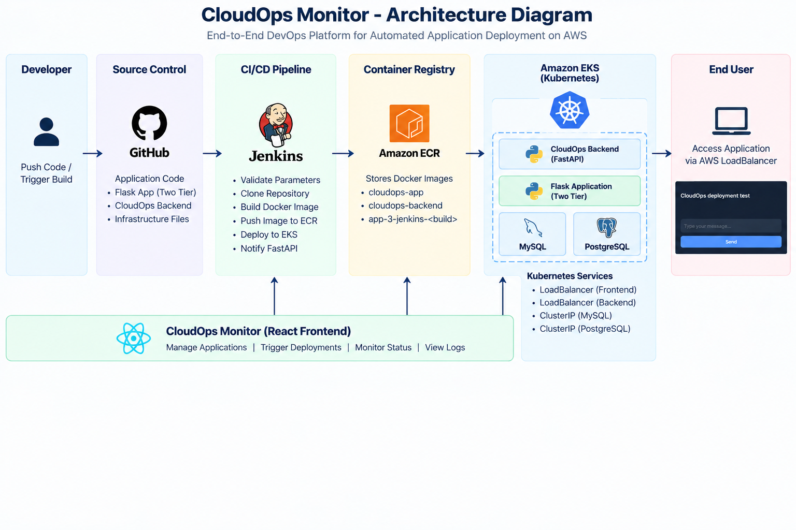
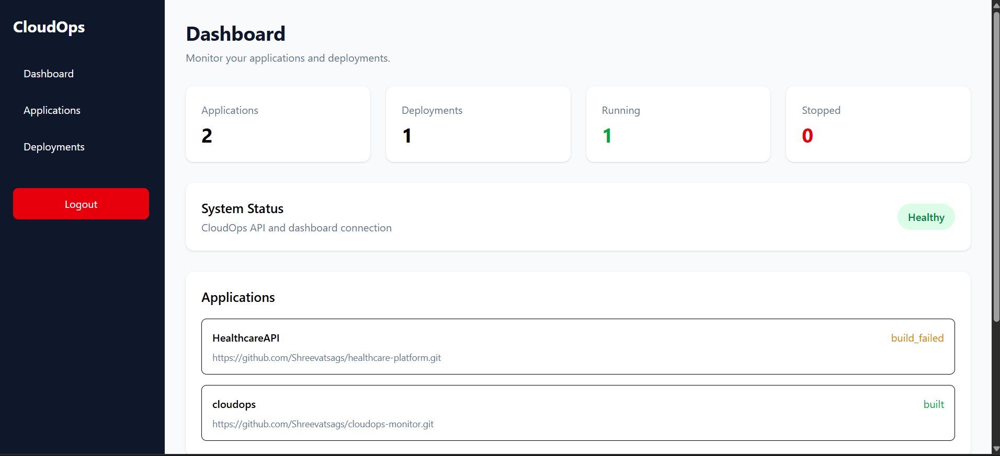
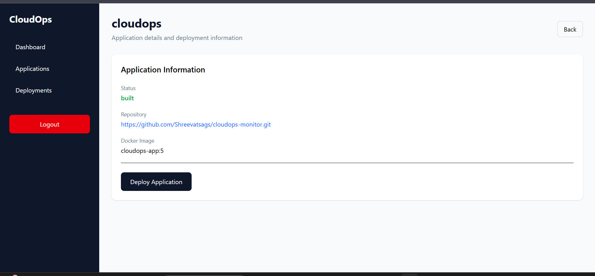
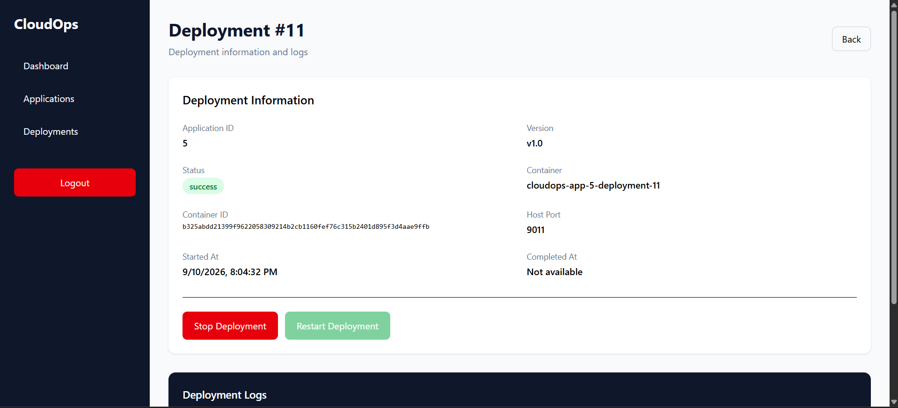
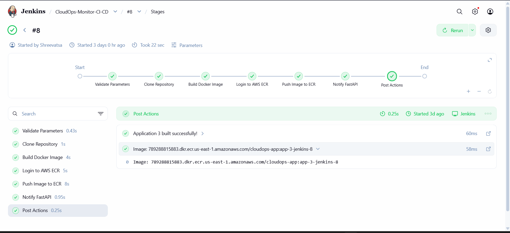
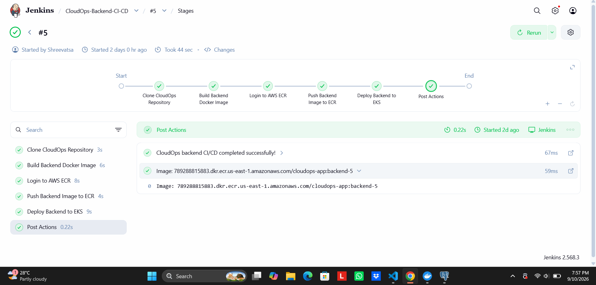
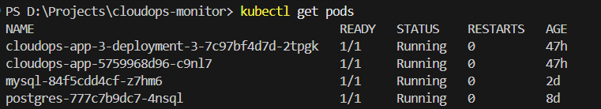
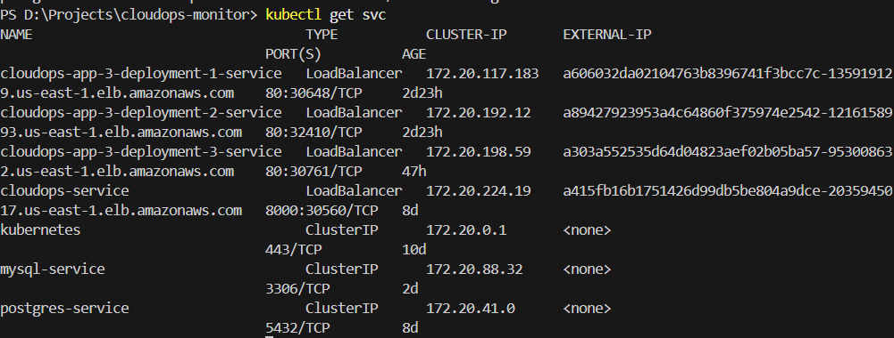
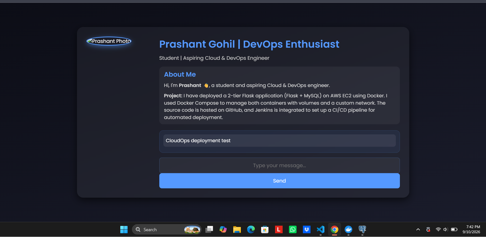

# CloudOps Monitor

CloudOps Monitor is a full-stack DevOps and Cloud Operations platform for managing applications, CI/CD pipelines, Docker images, and Kubernetes deployments.

The project demonstrates an end-to-end DevOps workflow using React, FastAPI, PostgreSQL, Docker, Jenkins, Kubernetes, Terraform, and AWS.

## Architecture



```text
Developer
    |
    v
  GitHub
    |
    v
Jenkins CI/CD
    |
    v
Amazon ECR
    |
    v
Amazon EKS
    |
    +------------------+
    |                  |
    v                  v
FastAPI          User Applications
    |                  |
    v                  v
PostgreSQL           MySQL
    |
    v
React Dashboard
```

## Features

- JWT-based user authentication
- Application creation and management
- GitHub repository integration
- Jenkins CI/CD pipeline triggering
- Automated Docker image builds
- Amazon ECR image publishing
- Kubernetes application deployment
- Kubernetes Service creation
- Deployment status and logs
- Stop and restart deployments
- PostgreSQL integration
- MySQL support for two-tier applications
- Kubernetes RBAC
- AWS infrastructure provisioning with Terraform

## Technology Stack

| Category | Technologies |
|---|---|
| Frontend | React, Vite, Tailwind CSS, Axios, React Router |
| Backend | Python, FastAPI, SQLAlchemy, Pydantic |
| Databases | PostgreSQL, MySQL |
| Containers | Docker, Docker Compose |
| CI/CD | Jenkins |
| Kubernetes | Kubernetes, Minikube, kubectl |
| Cloud | AWS EKS, ECR, VPC, IAM, EC2, LoadBalancer |
| Infrastructure | Terraform |
| Web Server | Nginx |

## CI/CD Pipeline

### Application Pipeline

```text
GitHub Repository
       |
       v
    Jenkins
       |
       v
Validate Parameters
       |
       v
Clone Repository
       |
       v
Build Docker Image
       |
       v
Login to Amazon ECR
       |
       v
Push Image to ECR
       |
       v
Notify FastAPI
```

The application pipeline:

1. Clones the application repository
2. Builds the Docker image
3. Logs in to Amazon ECR
4. Pushes the image to ECR
5. Notifies the FastAPI backend

### Backend Pipeline

```text
CloudOps Monitor
      |
      v
   Jenkins
      |
      v
Build Backend Image
      |
      v
Amazon ECR
      |
      v
Amazon EKS
      |
      v
Kubernetes Rollout
```

The backend pipeline builds the FastAPI Docker image, pushes it to ECR, updates the Kubernetes deployment, and verifies the rollout.

## Kubernetes Deployment

Applications are deployed using Kubernetes Deployments and Services.

```text
AWS LoadBalancer
       |
       v
Flask Application
       |
       v
 mysql-service
       |
       v
     MySQL
```

The CloudOps backend and PostgreSQL database also run inside Kubernetes.

Kubernetes RBAC allows the backend to manage the required Deployments, Pods, and Services.

## Application Deployment Flow

```text
Create Application
        |
        v
Add GitHub Repository
        |
        v
Trigger Jenkins Build
        |
        v
Build Docker Image
        |
        v
Push Image to ECR
        |
        v
FastAPI Receives Image
        |
        v
Deploy Application
        |
        v
Kubernetes Creates Pod
        |
        v
Kubernetes Service
        |
        v
Application Available
```

## AWS Infrastructure

AWS infrastructure was provisioned using Terraform.

The environment included:

- Amazon VPC
- Public and private subnets
- Internet Gateway
- NAT Gateway
- Amazon EKS
- EKS Node Group
- Amazon ECR
- IAM
- AWS LoadBalancer

Terraform workflow:

```bash
terraform init
terraform fmt
terraform validate
terraform plan
terraform apply
```

To destroy the infrastructure after testing:

```bash
terraform destroy
```

The AWS infrastructure used for testing was destroyed after completion to avoid unnecessary ongoing cloud costs.

## Project Structure

```text
cloudops-monitor/
│
├── backend/
│   ├── app/
│   │   ├── models/
│   │   ├── routes/
│   │   ├── schemas/
│   │   ├── services/
│   │   └── main.py
│   ├── Dockerfile
│   └── requirements.txt
│
├── frontend/
│   ├── src/
│   │   ├── pages/
│   │   ├── services/
│   │   └── ...
│   ├── Dockerfile
│   └── package.json
│
├── k8s/
│   ├── deployment.yaml
│   ├── cloudops-rbac.yaml
│   └── mysql.yaml
│
├── terraform/
│   ├── main.tf
│   ├── variables.tf
│   └── outputs.tf
│
├── docs/
│   ├── architecture.png
│   ├── demo.mp4
│   └── screenshots/
│
├── docker-compose.yml
├── README.md
└── .gitignore
```

## Screenshots

### Dashboard



### Application Details



### Deployment Details



### Jenkins Application CI/CD



### Jenkins Backend CI/CD



### Kubernetes Pods



### Kubernetes Services



### Deployed Flask Application



## Demo

A short walkthrough demonstrating the CloudOps Monitor dashboard, application deployment workflow, Jenkins CI/CD pipeline, and Kubernetes deployment.

[▶️ Watch the CloudOps Monitor Demo](docs/demo.mp4)

## Local Development

### Prerequisites

- Git
- Docker Desktop
- Python
- Node.js
- kubectl
- Minikube
- Terraform
- AWS CLI

### Clone Repository

```bash
git clone <YOUR_GITHUB_REPOSITORY_URL>
cd cloudops-monitor
```

### Run with Docker Compose

```bash
docker compose up --build
```

### Run Kubernetes Locally

```bash
minikube start --driver=docker
kubectl apply -f k8s/
kubectl get pods
kubectl get svc
```

## Key Highlights

- Full-stack React + FastAPI application
- JWT authentication
- Dockerized frontend and backend
- Jenkins CI/CD automation
- Amazon ECR integration
- Amazon EKS deployment
- Kubernetes-native application management
- Kubernetes RBAC
- PostgreSQL integration
- MySQL-based two-tier application deployment
- Terraform Infrastructure as Code
- AWS LoadBalancer integration
- Deployment logs and lifecycle controls

## Security

Never commit sensitive information to GitHub.

Do not commit:

```text
.env
AWS access keys
AWS secret keys
JWT tokens
Jenkins API tokens
ngrok authentication tokens
Database passwords
```

## Project Status

**Completed**

The complete workflow was successfully demonstrated:

```text
React
  |
  v
FastAPI
  |
  v
Jenkins
  |
  v
Docker
  |
  v
Amazon ECR
  |
  v
Amazon EKS
  |
  v
Kubernetes Application
  |
  v
AWS LoadBalancer
```

The AWS infrastructure used during testing was intentionally destroyed after completion to prevent unnecessary ongoing cloud costs.

## Author

**Shreevatsa**

CloudOps Monitor — Full-Stack DevOps & Cloud Deployment Platform

